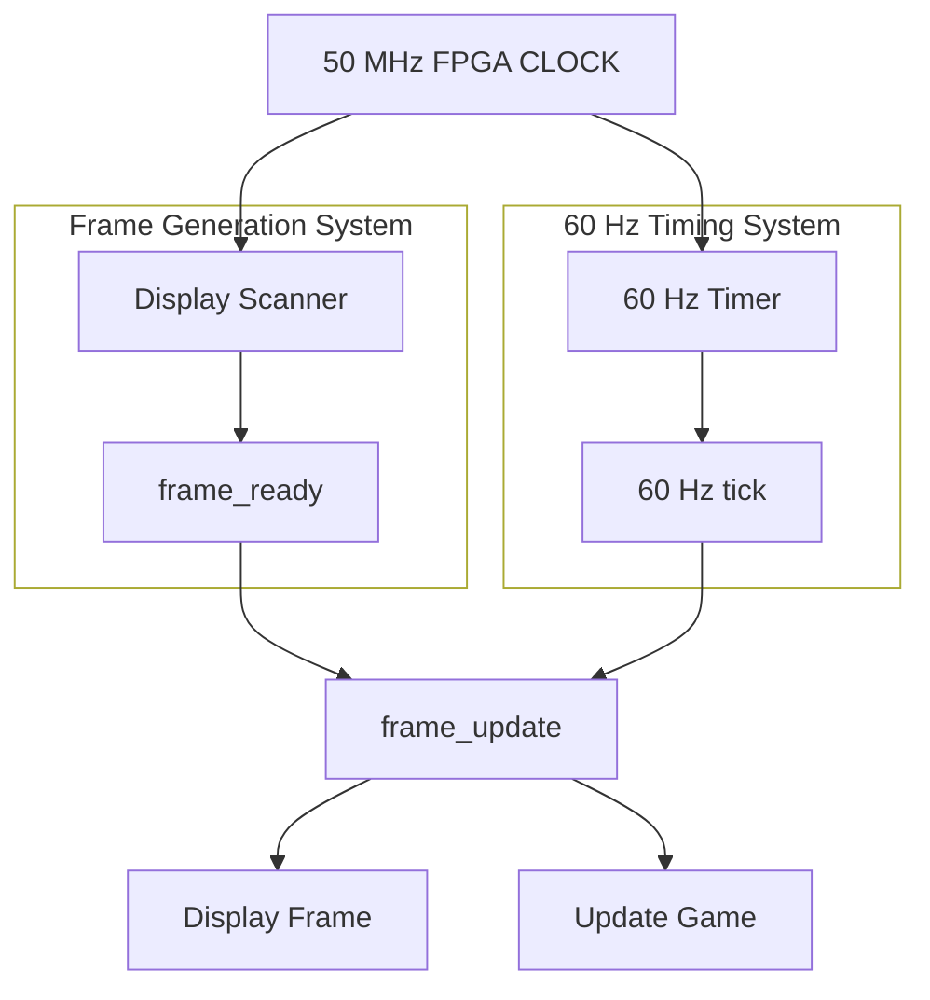

# FPGA-MiniConsole
Creating SystemVerilog code to recreate classic games

## Project Breakdown  
## Display and Timing
The first project to tackle is the display and timing system. This covers the following:
### Define the virtual screen:
- Resolution : 160 x 144
- Coordinates : X = 0 --> 159. Y = 0 --> 143
- Colour Depth: 2 Bits
- Colours: 4
- Target FPSL 60Hz

**In a original Game Boy's style:**
- 00 = white
- 01 = light grey
- 10 = dark grey
- 11 = black  
The most fundamental part is that there is two counters that cycle through each row and column.
### 60 FPS timing and `frame_ready`
Rather than X/Y scanning speed determining frame rate. I'm going to implement a frame_ready and a 60 fps update rate. So when both of these are valid the next frame will be displayed.
### Renderer Architecture  

## Menu  
**The menu needs to achieve the following:**  
- Display a list of games (Game Display)
- Control the selection of games

