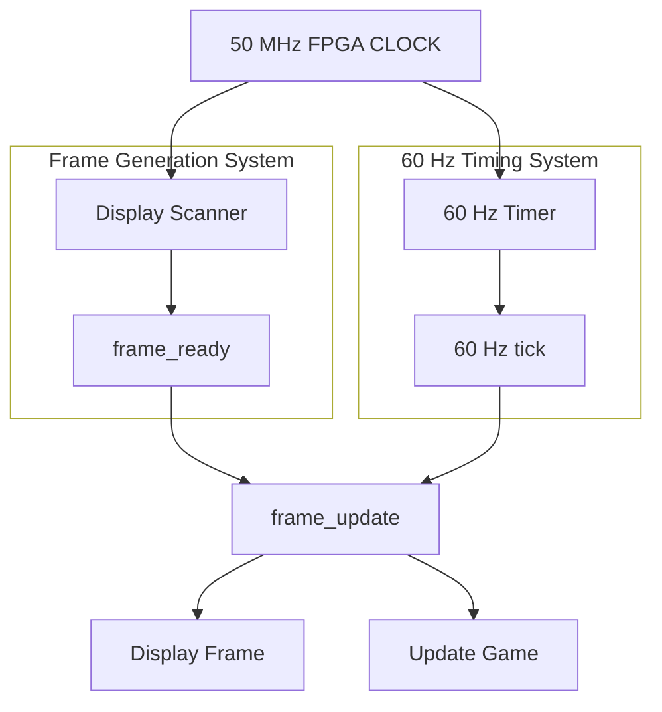

# FPGA-MiniConsole
Creating SystemVerilog code to recreate classic games

# Project Breakdown  
## Frame Generation
The first step to successfully completing the display is the frame generation. The role of the frame generation is to create a complete display frame. 

The spec is as seen below:

# Module Specification: `FrameGenerator`

## 1. Module Name
`FrameGenerator`

## 2. Purpose
The frame generator controls which screen pixel is currently being generated and where that pixel should be stored in the framebuffer.

## 3. Inputs

|Name|Bit Count|Purpose|
|----|---------|-------|
|`clk`|`1`|The clock signal from the board|
|`rst`|`1`|Resets frame generation to the first pixel|
|`start_frame`|`1`|Starts generation of a new frame|
|`pixel_data`|`2`|Pixel value generated by the renderer for the current pixel coordinate|

## 4. Outputs
- `newXAddr` (`16` bit bus) : Stores the x-coordinates for the ball.
- `newYAddr` (`18` bit bus) : Stores the y-coordinates for the ball.

## 5. Internal State
The internal states this module stores are in the registers as follows:
- `newXAddr` : The current ball x-coordinates
- `newYAddr` : The current ball y-coordinates
- `dir_x` : The current horizontal movement direction.
- `dir_y` : The current vertical movement direction.
- `enable_flag` : Stores whether the ball movement has been started.

## 6. Behaviour
The module behaves as follows:
- it initializes the ball to a known central starting position on reset (Centre of the screen)
- Direction is insitialised as positive x and positive y
- it waits for an enable signal before gameplay begins
- once started, it updates the ball position once per frame
- it stores and updates the ball’s horizontal and vertical travel direction
- it reverses horizontal direction on side-wall collision
- it reverses vertical direction on paddle collision
- it moves the ball by a configurable step size
- it constrains the ball position so it stays within the play area

## 7. Clocking and Reset
The module takes in the board's clock (`clk`) input. The postive edge is used to check if the game has been started. However it doesn't control the update of ball location it is just used to check if the game has been enabled and if the reset has been activated.

The reset (`rst`) is used to reset the ball's position back to the centre and its direction of travel. It is also used to disable the enable register which stops the ball from moving.

## 8. Timing / Update Rules
The `rst` based commands such as reseting ball direction and location, and `enable_flag` is  updated by depending on `clk`  
The location and direction updates of the ball while its moving relies on the `clk` cycle for the main timing and specifically `enable_flag` and `frame_tick` must both be true for the update to happen.
The direction is updated when a value to the input is changed. The rest of the direction update is purely combinational.

## 9. Edge Cases
- On `rst=1`, ball position must return to the centre of the screen (start coordinates), default movement directions must be assigned, and the enable latch must be cleared.
- if `enable` has not yet been asserted, the ball must remain stationary even if `frame_tick` is active.
- A momentary `enable` pulse must be latched so the motion of the ball continues after the `enable` switch is set to low.
- If `frame_tick=0`, the position and direction should not update.
- The ball position/coordinates should not go beyong the boundaries of the screen.
- If `ballStep` is large, make sure no invalid coordinates are produced.
- If Reset is asserted diring aactive motion, it must immediatley override module and reset ball position.

## 10. Interfaces / Dependencies  
Drives `newXAddr` and `newYAddr` into the collisionEngine and into `pongTop`  
Consumes `clk`, `frame_tick`, `rst` and `enable` from `pongTop`  
Consumes `ballStep` from difficultyEngine  
Consumes `hit_left`, `hit_right`, `topPaddleHit` and `bottomPaddleHit` from collisionEngine  
## 11. Verification Considerations
Must test:
- Correct reset behaviour for ball position, default directions, and cleared enable latch.
- That the ball doesnt move until enable is asserted.
- That the when `enable` is pulsed the the enable latches, until reset.
- That the position updates only when `frame_tick` is active.

## Display and Timing
The second project to tackle is the display and timing system. This covers the following:
### Define the virtual screen:
- Resolution : 160 x 144
- Coordinates : X = 0 --> 159. Y = 0 --> 143
- Colour Depth: 2 Bits
- Colours: 4
- Target FPSL 60Hz

**In a original Game Boy's style:**
- 00 = white
- 01 = light grey
- 10 = dark grey
- 11 = black  
The most fundamental part is that there is two counters that cycle through each row and column.
### 60 FPS timing and `frame_ready`
Rather than X/Y scanning speed determining frame rate. I'm going to implement a frame_ready and a 60 fps update rate. So when both of these are valid the next frame will be displayed.
### Renderer Architecture  

## Menu  
**The menu needs to achieve the following:**  
- Display a list of games (Game Display)
- Control the selection of games

